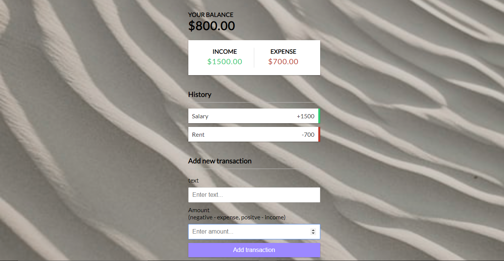

# Expense Tracker

This expense tracking app allows users to add both income and expense items and then provides the user with their total balance.

## [Try it out] (https://solomangarcia.github.io/expense-tracker/)

## Built With

* [JavaScript](https://www.javascript.com/) - Programming language

## Authors
See contribution history [here](https://github.com/SolomanGarcia/expense-tracker/graphs/contributors)

## Future Updates
At the moment, this app is a minimum viable product. In the future the UI/UX will be improved and the app will be converted to React and then a full-stack app using MongoDB and Express.js.